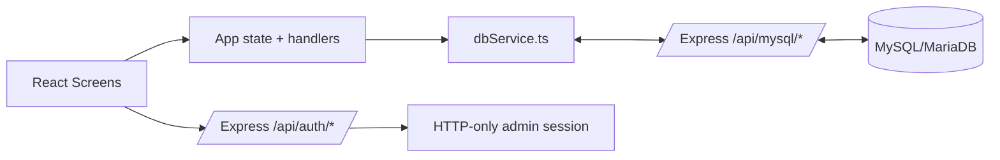

# Persistencia Actual - MadridLiveApp

## Resumen Ejecutivo

La fuente de verdad de datos de negocio es **MySQL/MariaDB**.

El frontend React consume el backend Express mediante `src/dbService.ts`, que centraliza polling, CRUD, seed y reset contra `/api/mysql/*`. Firestore queda fuera de la ruta activa de persistencia.

## Capa Activa

Tablas activas:

- `staff`
- `events`
- `shifts`
- `alerts`

Patron de acceso:

- Lectura por polling desde `dbService.ts` con cookie de sesion admin same-origin.
- Escritura mediante endpoints Express en `mysqlApi.ts`.
- Fichaje operativo mediante `POST /api/mysql/checkin` y `POST /api/mysql/checkout`.
- Validacion y saneamiento de payloads en `src/validators.ts`.
- Reset a datos iniciales mediante `POST /api/mysql/reset-initial`, protegido por auth admin y ejecutado en transaccion MySQL.

Archivos clave:

- `mysqlApi.ts`: esquema, migraciones, CRUD, validaciones de integridad y reset transaccional.
- `src/dbService.ts`: cliente API usado por la UI.
- `src/App.tsx`: orquesta subscriptions y mutaciones de negocio.
- `server.ts`: auth admin, endpoint de conectividad MariaDB y registro del API MySQL.

## Autenticacion Admin

- Browser admin: `POST /api/auth/login` crea una cookie HTTP-only firmada.
- Scripts/CI: pueden usar `x-admin-token` con `ADMIN_API_TOKEN`.
- Las lecturas de datos de negocio (`staff`, `events`, `shifts`, `alerts`) y las lecturas administrativas (`status`, `schema-check`) requieren cookie admin o `x-admin-token`.
- `/api/mysql/health-count` queda publico solo para smokes/watchdogs: devuelve conteos y estado de esquema, sin filas ni datos personales.
- El frontend no debe exponer tokens admin mediante variables `VITE_*`.

Variables relevantes:

- `ADMIN_LOGIN_EMAIL`
- `ADMIN_LOGIN_PASSWORD`
- `ADMIN_SESSION_SECRET` o `ADMIN_API_TOKEN`
- `MYSQL_HOST`
- `MYSQL_PORT`
- `MYSQL_USER`
- `MYSQL_PASSWORD`
- `MYSQL_DATABASE`

## Mapa de Operaciones por Coleccion

### staff

Lectura:

- `subscribeToStaff`.

Escritura:

- `addStaff`, `addStaffBatch`, `updateStaff`, `deleteStaff`.
- El flujo operativo de escaner/perfil no debe alternar IN/OUT con `updateStaff` directo: usa `checkInWorker` / `checkOutWorker`, que actualizan `staff` y `shifts` en una sola transaccion.

### events

Lectura:

- `subscribeToEvents`.

Escritura:

- `addEvent`, `updateEvent`, `deleteEvent`.

### shifts

Lectura:

- `subscribeToShifts`.

Escritura:

- `addShift`, `updateShift`, `deleteShift`.
- El CRUD directo queda para herramientas administrativas; la creacion/cierre normal de turnos debe pasar por `checkInWorker` / `checkOutWorker`.
- Los payloads legacy con `location` estan bloqueados; usar `eventId/eventTitle`.

### alerts

Lectura:

- `subscribeToAlerts`.

Escritura:

- `addAlert`, `updateAlert`, `deleteAlert`.

## Flujo de Datos Actual

## Implicaciones Operativas

1. Un problema en MySQL afecta a la operacion normal de la app.
2. Las lecturas y mutaciones admin requieren cookie de sesion valida o `x-admin-token` en scripts/CI.
3. `DELETE /staff` debe permanecer protegido en CI por defecto.
4. Cualquier cambio de esquema debe pasar por migracion controlada y validacion de `npm run test:api:shifts:regression`.
5. Los flujos de entrada/salida de trabajadores deben ser atomicos; no separar el cambio de estado de `staff` de la creacion/cierre del `shift`.

## Recomendacion

Mantener MySQL como unica fuente activa. Si se reintroduce otra persistencia en el futuro, hacerlo solo con un plan explicito de doble escritura, reconciliacion y rollback.
