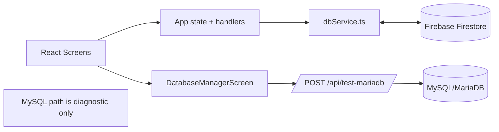

# Persistencia Actual - MadridLiveApp

## Resumen Ejecutivo
La fuente de verdad de datos de negocio es **Firebase Firestore**.

La integración con **MySQL/MariaDB** existe actualmente como utilidad de diagnóstico/conectividad y como guía de migración en UI, pero **no** como capa de persistencia activa de la app.

## Estado de la Capa de Persistencia

### 1) Capa Activa (Producción): Firestore
Colecciones activas:
- `staff`
- `events`
- `shifts`
- `alerts`

Patrón de acceso:
- Lectura en tiempo real con `onSnapshot`.
- Escritura con `setDoc`, `updateDoc`, `deleteDoc`, `writeBatch`.
- Auto-seed inicial si `staff` está vacía.

Archivos clave:
- `src/firebase.ts`: inicialización de Firebase/Firestore.
- `src/dbService.ts`: listeners + CRUD + reset/seed.
- `src/App.tsx`: orquesta subscriptions y dispara mutaciones mediante handlers.

### 2) Capa No Activa para negocio: MySQL/MariaDB
Uso actual:
- Endpoint backend `POST /api/test-mariadb` para comprobar conectividad, versión y acceso básico a DB.
- No existen endpoints de negocio para CRUD sobre MySQL.
- En UI (`DatabaseManagerScreen`) se muestran snippets SQL/Express de ejemplo para una futura migración.

Archivos clave:
- `server.ts`: endpoint `/api/test-mariadb`.
- `src/components/DatabaseManagerScreen.tsx`: formulario de test + snippets.

## Mapa de Operaciones por Colección

### staff
Lectura:
- `subscribeToStaff` (realtime).

Escritura:
- `addStaff`, `addStaffBatch`, `updateStaff`, `deleteStaff`.
- Actualización de estado IN/OUT desde escáner/perfil (`updateStaff`).

### events
Lectura:
- `subscribeToEvents`.

Escritura:
- `addEvent`, `updateEvent`, `deleteEvent`.

### shifts
Lectura:
- `subscribeToShifts`.

Escritura:
- `addShift`, `updateShift`, `deleteShift`.
- Se crean/cierran turnos al alternar IN/OUT de un trabajador.

### alerts
Lectura:
- `subscribeToAlerts`.

Escritura:
- `addAlert`, `updateAlert`, `deleteAlert`.

## Mapa por Pantalla (qué usa realmente)

- Dashboard
  - Consume `events`, `alerts`, `staff` desde estado sincronizado con Firestore.
  - Sin escritura directa.

- Staff
  - Alta de personal via `addStaff` (y en flujo de alta también se crea turno inicial con `addShift` desde `App`).

- Scanner
  - Toggle IN/OUT:
    - `updateStaff` (estado, horas, ubicación, etc.)
    - `addShift` al entrar
    - `updateShift` al salir

- Profile
  - Reutiliza el mismo toggle IN/OUT que Scanner.

- Shifts
  - Consulta de historial ya sincronizado desde Firestore.

- KPIs
  - Lectura de colecciones ya cargadas en memoria desde Firestore.

- Database Manager
  - CRUD manual de las 4 colecciones en Firestore.
  - Reset completo a valores iniciales (`forceResetDatabase`).
  - Test de conexión MariaDB vía `/api/test-mariadb`.

## Flujo de Datos Actual

## Implicaciones Operativas

1. Los datos de negocio (personal, eventos, turnos, alertas) se guardan y leen en Firestore.
2. Un problema en MySQL no afecta a la operación normal de la app salvo al test de conectividad de la pantalla de administración.
3. Si se quiere migrar persistencia real a MySQL, hay que implementar:
   - API CRUD de negocio en backend.
   - Sustitución/abstracción de `dbService.ts`.
   - Estrategia de migración de datos desde Firestore.

## Recomendación

Mantener Firestore como fuente de verdad mientras no exista backend CRUD completo en MySQL. Si se decide migrar, hacerlo por fases con feature flag y doble escritura temporal para validar consistencia.
